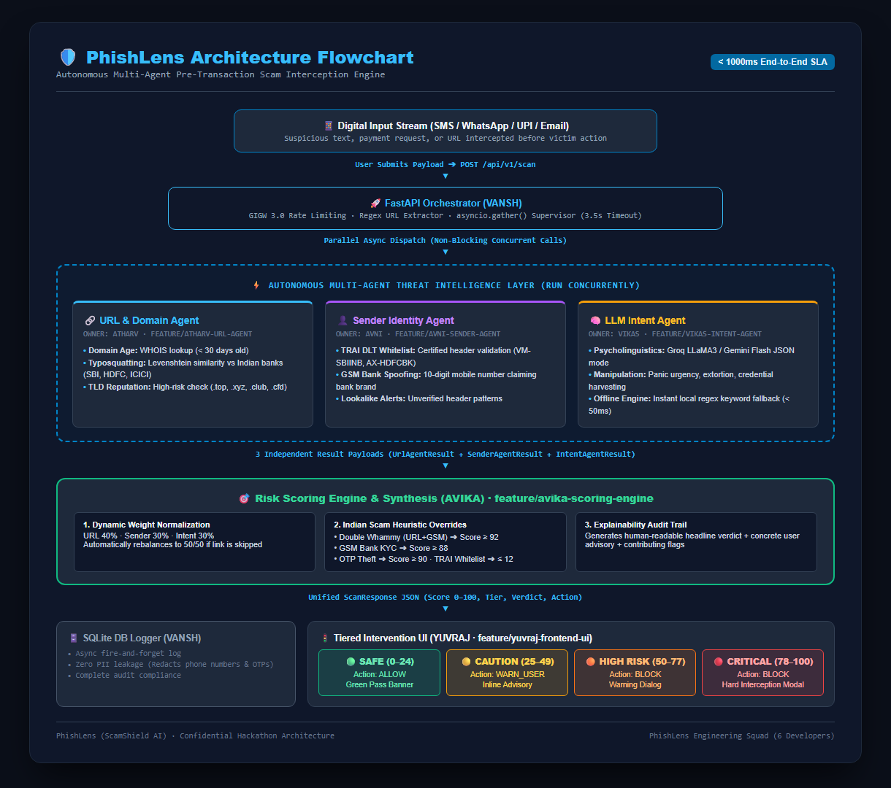

<div align="center">

# 🔍 PhishLens

### Real-Time Explainable Multi-Vector Scam Interception Engine

[](https://fastapi.tiangolo.com)
[](https://reactjs.org)
[](https://python.org)
[](https://groq.com)
[](docs/TEAM_IMPLEMENTATION_PLAN.md)
[](LICENSE)

> **Stop scams before they strike.** PhishLens is an active, pre-transaction interception layer that evaluates messages, URLs, and payment requests across 3 parallel vectors to block scams in **sub-1000ms** before a user clicks an irreversible link, shares an OTP, or authorizes a fraudulent payment.

[🚀 Live Demo](#-quick-start) · [📖 Docs](#-how-phishlens-works) · [🐛 Report Bug](https://github.com/avksr/PhishLens/issues) · [💡 Request Feature](https://github.com/avksr/PhishLens/issues)

</div>

---

## 📌 The Problem

Over **₹1,750 Crore** is lost annually to cyber fraud in India. Traditional solutions (such as Chakshu and post-hoc registries) operate **reactively** — victims report after funds or sensitive OTPs have already been stolen.

Attackers systematically exploit three parallel vulnerabilities:

| Vector | How Attackers Exploit It | PhishLens Interception Defense |
|:---|:---|:---|
| 🔗 **URL / Domain** | Register fresh phishing domains (< 7 days old) mimicking SBI, HDFC, Amazon — bypassing blacklists that update in 24–72 hours | Levenshtein typosquatting detection against official brands + high-risk TLD checks (`.top`, `.xyz`, `.club`, `.cfd`) + WHOIS domain age inspection |
| 👤 **Sender Identity** | Use personal 10-digit GSM numbers (`+91-XXXXXXXXXX`) to impersonate official banks, bypassing SMS carrier filters | TRAI DLT header format verification (`^[A-Z]{2}-[A-Z]{6}$`) + certified entity cross-checks + GSM bank impersonation flagging |
| 🧠 **Psychological Manipulation** | Craft fear-based panic ("blocked in 2 hours", "digital arrest", "CBI warrant") to bypass rational scrutiny | Psycholinguistic manipulation analysis via Groq LLaMA-3 / Gemini with deterministic <15ms offline heuristic fallback |

---

## ✨ How PhishLens Works

PhishLens runs **three independent AI agents in parallel** supervised by an async orchestrator, then synthesizes their findings through a dynamic scoring engine into a unified, explainable verdict in **< 1000ms** (Strict Hackathon SLA: < 5.0s).

<div align="center">



</div>

```
User Input (SMS / WhatsApp / Email / UPI)
         │
         ▼
┌─────────────────────────────────────────┐
│         FastAPI Orchestrator (Vansh)    │
│    asyncio.gather (3.5s SLA Timeout)    │
└──────────┬──────────────┬──────────┬───┘
           │              │          │
     ┌─────▼─────┐  ┌─────▼───┐  ┌──▼──────────┐
     │ URL Agent │  │ Sender  │  │ Intent Agent│
     │ (Atharv)  │  │ (Avni)   │  │  (Vikas)    │
     │ Typosquat │  │ TRAI DLT│  │  LLM / Fast │
     │ TLD check │  │ GSM Rule│  │  Heuristics │
     └─────┬─────┘  └─────┬───┘  └──┬──────────┘
           └──────────────┴──────────┘
                          │
                ┌─────────▼─────────┐
                │  Risk Scoring     │
                │  Engine (Avika)   │
                │  Dynamic Weights  │
                │  + Escalations    │
                └─────────┬─────────┘
                          │
          ┌───────────────┴───────────────┐
          ▼                               ▼
  ScanResponse JSON             SQLite Audit DB (Vansh)
  SAFE / CAUTION /              (Async, Zero-Trust PII Masked:
  HIGH_RISK / CRITICAL           10-digit phone & OTP redacted)
          │
          ▼
   React Dashboard (Yuvraj)
   Speedometer Gauge + Audit Drawer
   + Pre-Transaction Interception Modal
```

---

## 🚦 Risk Tiers & The 4-Tier Decision Matrix

| Tier | Score Range | Frontend UI Behavior | Action Required | Interception Mode |
|:---|:---|:---|:---|:---|
| ✅ **SAFE** | 0–24 | Green confirmation banner | `ALLOW` | Frictionless pass-through |
| ⚠️ **CAUTION** | 25–49 | Amber inline warning advisory | `WARN_USER` | Advises manual sender verification |
| 🚫 **HIGH_RISK** | 50–77 | Orange persistent alert card | `BLOCK_TRANSACTION` | Explicit user confirmation required |
| 🛑 **CRITICAL** | 78–100 | **Full-Screen Hard Block Interception Modal** | `BLOCK_TRANSACTION` | Actively prevents payment or OTP submission |

---

## ⚡ Dynamic Weight Redistribution & Escalation Overrides

### Dynamic Weight Normalization
When all agents are active, baseline weights are:
- **URL Agent**: $40\%$ ($W_{url} = 0.40$)
- **Sender Agent**: $30\%$ ($W_{sender} = 0.30$)
- **Intent Agent**: $30\%$ ($W_{intent} = 0.30$)

$$\text{Base Score} = (S_{url} \times W_{url}) + (S_{sender} \times W_{sender}) + (S_{intent} \times W_{intent})$$

If any vector is missing (e.g. no URL in SMS $\to$ `status = SKIPPED`) or encounters a network error, its weight is zeroed out and remaining active agent weights are dynamically rebalanced to sum to $1.0$:

$$w_i = \frac{W_i}{\sum_{k \in \text{active}} W_k}$$

### Critical Escalation Overrides (Non-Linear Safety Net)
Linear weighted averaging can fail against multi-layered deception. PhishLens enforces 5 deterministic escalation rules:

1. **Double Whammy (High-Risk URL + Spoofed / High-Risk Sender)**:
   - Condition: $S_{url} \ge 80$ AND $S_{sender} \ge 80$
   - Override: $\text{Score} \leftarrow \max(\text{Score}, 92.0)$ $\to$ `CRITICAL` / `BLOCK_TRANSACTION`
2. **Personal GSM Bank Impersonation**:
   - Condition: Sender is a 10-digit GSM number claiming bank identity with KYC/panic urgency
   - Override: $\text{Score} \leftarrow \max(\text{Score}, 88.0)$ $\to$ `CRITICAL` / `BLOCK_TRANSACTION`
3. **Active OTP / Credential Harvesting**:
   - Condition: Demands OTP, UPI PIN, or NetBanking password under urgency or suspicious sender/URL
   - Override: $\text{Score} \leftarrow \max(\text{Score}, 90.0)$ $\to$ `CRITICAL` / `BLOCK_TRANSACTION`
4. **Digital Arrest & Coercive Psychological Extortion**:
   - Condition: Threatens police arrest, CBI inquiry, or legal prosecution to induce panic
   - Override: $\text{Score} \leftarrow \max(\text{Score}, 82.0)$ $\to$ `HIGH_RISK` / `BLOCK_TRANSACTION`
5. **Certified TRAI DLT Exemption (Safe Override)**:
   - Condition: Verified official TRAI DLT header with no high-risk URL or coercion markers
   - Override: $\text{Score} \leftarrow \min(\text{Score}, 12.0)$ $\to$ `SAFE` / `ALLOW`

---

## 🔒 GIGW 3.0 & Zero-Trust Cybersecurity Compliance

To comply with **GIGW 3.0** and zero-trust standards:
- **Phone Redaction**: Personal Indian mobile numbers are redacted (e.g., `+91-XXXXX-3210`) before entering the audit storage layer.
- **Credential Redaction**: 4 to 6-digit standalone OTPs and UPI PINs are scrubbed (`[REDACTED_CREDENTIAL]`).
- **Audit DB**: Every scan produces an immutable, PII-sanitized audit trail in SQLite (`db_logger.py`).

---

## 🏗️ Project Structure

```
PhishLens/
├── backend/                         # FastAPI Python backend
│   ├── main.py                      # App entry point
│   ├── api/
│   │   ├── __init__.py
│   │   └── routes.py                # POST /api/v1/scan and /health endpoints
│   ├── shared/
│   │   ├── __init__.py
│   │   └── models.py                # 🔑 Shared Pydantic models (Single Source of Truth)
│   ├── agents/
│   │   ├── __init__.py
│   │   ├── url_agent.py             # Atharv — Typosquatting, WHOIS age, high-risk TLDs
│   │   ├── sender_agent.py          # Avni   — TRAI DLT validation, GSM bank spoofing
│   │   └── intent_agent.py          # Vikas  — Groq/Gemini LLM + <15ms offline fallback
│   ├── core/
│   │   ├── __init__.py
│   │   ├── orchestrator.py          # Vansh  — Parallel asyncio.gather + 3.5s supervisor
│   │   ├── scoring_engine.py        # Avika  — Dynamic weighting + escalation rules
│   │   ├── verdict_utils.py         # Avika  — Human-readable explainable verdicts
│   │   └── db_logger.py             # Vansh  — aiosqlite logger with PII masking
│   ├── data/
│   │   ├── brand_domains.json       # Legitimate banking domain mappings (Atharv)
│   │   ├── high_risk_tlds.txt       # Malicious TLD blacklist (.top, .xyz, etc.)
│   │   └── trai_dlt_registry.json   # Certified TRAI principal entity headers (Avni)
│   ├── prompts/
│   │   └── intent_prompt.txt        # Vikas  — Deterministic JSON system prompt
│   ├── tests/
│   │   ├── __init__.py
│   │   ├── test_models.py           # Pydantic schema validation tests
│   │   ├── test_scoring.py          # Scoring engine & escalation override tests
│   │   └── test_pipeline.py         # End-to-end integration tests (< 1000ms SLA)
│   └── requirements.txt
│
├── frontend/                        # React + Vite dashboard (Yuvraj)
│   ├── src/
│   │   ├── components/              # Speedometer, Interception Modal, Audit Drawer
│   │   ├── lib/
│   │   │   └── api.ts               # API client
│   │   ├── App.tsx                  # Main Cyber Dashboard
│   │   └── index.css                # Dark cyber theme tokens (#0B0F19, #00F0FF, #FF3366)
│   └── package.json
│
├── datasets/                        # Standardized evaluation payloads
│   ├── payloads_high_risk.json      # Critical attack test cases (GSM spoof, .top, panic)
│   ├── payloads_safe.json           # Legitimate bank OTP & transactional messages
│   └── payloads_edge_cases.json     # Skipped URLs, unusual headers, boundary tests
│
├── docs/
│   ├── TEAM_IMPLEMENTATION_PLAN.md  # Squad engineering plan & execution checklist
│   └── PhishLens_Architecture_Flowchart.png # High-res architecture diagram
│
├── schema_mocks.json                # Master data contract & mock responses
├── .github/
│   ├── workflows/
│   │   └── ci.yml                   # GitHub Actions CI pipeline
│   ├── ISSUE_TEMPLATE/
│   │   ├── bug_report.yml
│   │   └── feature_request.md
│   └── pull_request_template.md
├── CONTRIBUTING.md
├── LICENSE
└── README.md
```

---

## ⚡ Quick Start

### Prerequisites
- Python 3.11+
- Node.js 18+
- Optional: Free [Groq API Key](https://console.groq.com) or [Gemini API Key](https://aistudio.google.com/app/apikey) *(Pipeline runs fully functional in offline mode using local heuristics if omitted)*

### 1. Clone the repo
```bash
git clone https://github.com/avksr/PhishLens.git
cd PhishLens
```

### 2. Backend Setup
```bash
cd backend

# Create and activate virtual environment
python -m venv venv
# Windows:
venv\Scripts\activate
# macOS/Linux:
source venv/bin/activate

# Install dependencies
pip install -r requirements.txt

# (Optional) Set up environment variables
cp .env.example .env
# Edit .env with your GROQ_API_KEY if desired

# Start the FastAPI server
uvicorn main:app --reload --port 8000
```

- API Endpoint: `http://localhost:8000`
- Interactive Swagger Docs: `http://localhost:8000/docs`

### 3. Run Backend Verification Suite
```bash
# From backend directory:
pytest tests/ -v
```

### 4. Frontend Setup
```bash
cd ../frontend
npm install
npm run dev
```

- Dashboard UI: `http://localhost:5173`

---

## 📡 API Reference

### `POST /api/v1/scan`

**Request:**
```json
{
  "content": "Dear Customer, Your SBI account has been suspended due to pending KYC update. Please verify OTP and submit PAN immediately within 2 hours at https://sbi-kyc-verify.top to avoid permanent deactivation.",
  "sender": "+919823145678",
  "extracted_url": "https://sbi-kyc-verify.top",
  "channel": "sms"
}
```

**Response (`ScanResponse`):**
```json
{
  "scan_id": "c7a8b3e1-9524-4f0e-b7d6-ec2d79d501b4",
  "timestamp": "2026-09-29T16:15:30Z",
  "overall_risk_score": 92,
  "risk_tier": "CRITICAL",
  "action_required": "BLOCK_TRANSACTION",
  "verdict": "Confirmed SBI Impersonation — KYC / Credential Harvesting Attack",
  "recommendation": "STOP — Legitimate banks NEVER send alerts from personal mobile numbers. Do NOT click external links or share OTP.",
  "processing_time_ms": 1.25,
  "audit_trail": {
    "url_analysis": {
      "status": "SUCCESS",
      "risk_score": 85.0,
      "is_typosquatting": true,
      "target_brand": "SBI",
      "tld_reputation": "HIGH_RISK",
      "flags": ["HIGH_RISK_TLD:.top", "BRAND_NAME_SPOOFING:SBI"],
      "latency_ms": 0.45
    },
    "sender_analysis": {
      "status": "SUCCESS",
      "risk_score": 85.0,
      "sender_category": "PERSONAL_GSM",
      "is_spoofed_header": true,
      "brand_claimed": "SBI",
      "flags": ["COMMERCIAL_BANK_CLAIMED_ON_PERSONAL_GSM"],
      "latency_ms": 0.32
    },
    "intent_analysis": {
      "status": "SUCCESS",
      "risk_score": 70.0,
      "detected_intent": "KYC_VERIFICATION",
      "manipulation_tactics": ["PANIC_URGENCY", "OTP_HARVEST", "PAN_HARVEST"],
      "confidence": 0.95,
      "latency_ms": 0.48
    },
    "synthesis_breakdown": {
      "weights_applied": {
        "url_weight": 0.40,
        "sender_weight": 0.30,
        "intent_weight": 0.30
      },
      "heuristics_triggered": [
        "CRITICAL_ESCALATION: Phishing URL combined with unauthorized / high-risk sender",
        "CRITICAL_ESCALATION: Personal mobile number impersonating bank with KYC/panic urgency"
      ],
      "summary_explanation": "Critical multi-vector attack detected: typosquatted domain hosted on high-risk TLD combined with personal GSM bank impersonation soliciting credentials."
    }
  }
}
```

See [`schema_mocks.json`](schema_mocks.json) for all mock payloads across safe, caution, and attack scenarios.

---

## 🛡️ Git Branch Strategy

```
main          ← Production-ready release branch (protected)
  └── dev     ← Integration branch (all feature branches merge here via PR)
        ├── feature/vansh-orchestrator     (Vansh  - Backend Orchestration & DB)
        ├── feature/atharv-url-agent       (Atharv - URL & Domain Intelligence)
        ├── feature/avni-sender-agent      (Avni   - Sender & TRAI DLT Agent)
        ├── feature/vikas-intent-agent     (Vikas  - LLM Intent & Fast Fallback)
        ├── feature/avika-scoring-engine   (Avika  - Risk Scoring & Synthesis)
        └── feature/yuvraj-frontend-ui     (Yuvraj - Frontend Dashboard & UI)
```

**PR Guidelines:**
- ❌ Never push directly to `main` or `dev`.
- ❌ Never commit `.env`, `venv/`, or `node_modules/`.
- ✅ Always import shared schemas from `backend/shared/models.py`.
- ✅ Ensure agent functions never crash the pipeline — return `status="ERROR"` on exceptions.
- ✅ Run `pytest backend/tests/ -v` before submitting pull requests.

---

## 👥 Engineering Squad

| Member | Role & Module | Feature Branch | Key Deliverables |
|:---|:---|:---|:---|
| **Project Lead / PM** | Architecture, Datasets & Standards | `main` | End-to-end integration, test datasets, GIGW 3.0 compliance |
| **Vansh** | Backend / Orchestrator | `feature/vansh-orchestrator` | Parallel `asyncio.gather` pipeline, 3.5s SLA supervisor, SQLite audit logger |
| **Atharv** | URL & Domain Agent | `feature/atharv-url-agent` | Typosquatting checks, brand matching, WHOIS age, high-risk TLD filters |
| **Avni** | Sender & TRAI DLT Agent | `feature/avni-sender-agent` | TRAI DLT regex validation, GSM bank spoofing detection, lookalike alerts |
| **Vikas** | LLM Psycholinguistic Intent Agent | `feature/vikas-intent-agent` | Groq LLaMA-3 / Gemini prompt inference, <15ms offline heuristic engine |
| **Avika** | Risk Scoring Engine & Synthesis | `feature/avika-scoring-engine` | Dynamic weight redistribution, escalation overrides, explainable verdicts |
| **Yuvraj** | Frontend Dashboard & UI | `feature/yuvraj-frontend-ui` | React cyber UI, animated speedometer, pre-transaction interception modal |

---

## 📄 License

Distributed under the MIT License. See [`LICENSE`](LICENSE) for details.

---

<div align="center">
Built with ❤️ for cyber defense hackathon · <a href="https://github.com/avksr/PhishLens">github.com/avksr/PhishLens</a>
</div>
