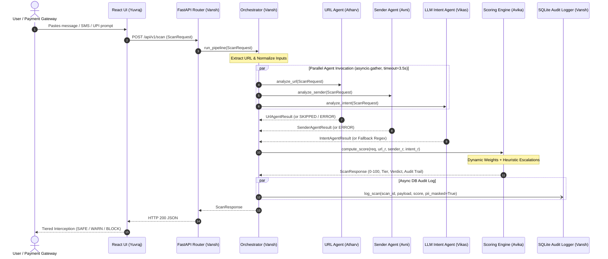

# 🛡️ PhishLens (ScamShield AI) — Team Implementation Plan & Execution Guide

**Project:** PhishLens — Real-Time Explainable Multi-Vector Scam Interception Engine  
**Target SLA:** Sub-1000ms End-to-End Interception (< 5.0s Strict Hackathon SLA)  
**Lead / Project Manager:** Avika Srivastava (@avksr)  
**Architectural Baseline:** GIGW 3.0 Cybersecurity Standards, Zero-Trust Input Sanitization, Explainable AI Audit Trails

---

## 1. Executive Summary & Team Roster

PhishLens is an active, pre-transaction scam interception system. It evaluates digital communications (SMS, WhatsApp, UPI, Emails) across three orthogonal vectors in parallel before synthesizing an explainable risk score (0–100) and actionable intervention tier.

### 👥 Team Matrix & Ownership

| Member | Role & Sub-system | Branch Name | Owned Files | Core Deliverable |
|:---|:---|:---|:---|:---|
| **Vansh** | Backend / Orchestrator | `feature/vansh-orchestrator` | `backend/core/orchestrator.py`<br>`backend/core/db_logger.py`<br>`backend/main.py`<br>`backend/api/routes.py` | `asyncio.gather` parallel pipeline, timeout supervisor (3.5s), async SQLite audit logger |
| **Atharv** | URL / Domain Agent | `feature/atharv-url-agent` | `backend/agents/url_agent.py`<br>`backend/data/brand_domains.json`<br>`backend/data/high_risk_tlds.txt`<br>`backend/tests/test_url_agent.py` | WHOIS domain age lookup, Levenshtein typosquatting detection, high-risk TLD reputation |
| **Avni** | Sender Identity Agent | `feature/avni-sender-agent` | `backend/agents/sender_agent.py`<br>`backend/data/trai_dlt_registry.json`<br>`backend/tests/test_sender_agent.py` | TRAI DLT alphabetic header regex (`[A-Z]{2}-[A-Z]{6}`), GSM bank spoofing detector |
| **Vikas** | LLM Intent Agent | `feature/vikas-intent-agent` | `backend/agents/intent_agent.py`<br>`backend/prompts/intent_prompt.txt`<br>`backend/tests/test_intent_agent.py` | Groq (LLaMA3-8B) / Gemini Flash psycholinguistic prompt, local regex fallback |
| **Avika** | Risk Scoring Engine | `feature/avika-scoring-engine` | `backend/core/scoring_engine.py`<br>`backend/core/verdict_utils.py`<br>`backend/tests/test_scoring.py` | Dynamic weight redistribution, critical heuristic escalation rules, verdict synthesis |
| **Yuvraj** | Frontend UI & Interception | `feature/yuvraj-frontend-ui` | `frontend/src/*`<br>`frontend/package.json` | React/Vite cyber-defense dashboard, animated risk meter, 4-tier intervention modals |

---

## 2. End-to-End Pipeline Architecture



---

## 3. Data Contract Reference

All team members **MUST** import request/response models from `backend/shared/models.py`. Never redefine Pydantic models locally!

### 3.1 Input: `ScanRequest`
```python
class ScanRequest(BaseModel):
    content: str               # Raw text (min 1, max 8000 chars)
    sender: Optional[str]      # e.g. "+919876543210" or "VM-SBIINB"
    extracted_url: Optional[str] # e.g. "https://sbi-kyc-update.top"
    channel: ChannelEnum       # "sms", "whatsapp", "email", "qr_payment", "web_url"
    metadata: Optional[dict]   # Client device info, timestamp
```

### 3.2 Output: `ScanResponse`
```python
class ScanResponse(BaseModel):
    scan_id: str               # UUID v4 string
    timestamp: str             # ISO 8601 UTC
    overall_risk_score: int    # 0 to 100
    risk_tier: RiskTierEnum    # SAFE (0-24), CAUTION (25-49), HIGH_RISK (50-77), CRITICAL (78-100)
    verdict: str               # Executive summary headline
    recommendation: str        # User-facing safety action
    action_required: ActionRequiredEnum # ALLOW, WARN_USER, BLOCK_TRANSACTION
    audit_trail: AuditTrail    # URL + Sender + Intent + Synthesis breakdown
    processing_time_ms: float  # Total latency (< 1000ms target)
```

---

## 4. Individual Team Member Assignments (Sprint 1)

### 👨‍💻 1. VANSH — Backend Orchestrator & Logging
* **Branch:** `feature/vansh-orchestrator`
* **Target Files:**
  * `backend/core/orchestrator.py`
  * `backend/core/db_logger.py`
  * `backend/tests/test_pipeline.py`
* **Responsibilities:**
  1. Implement `run_pipeline(req: ScanRequest) -> ScanResponse`:
     - Extract URL from `req.content` if `req.extracted_url` is None using regex: `r'https?://[^\s]+'`.
     - Dispatch `analyze_url(req)`, `analyze_sender(req)`, and `analyze_intent(req)` concurrently using `asyncio.gather(..., return_exceptions=True)`.
     - Enforce `asyncio.wait_for(timeout=3.5)` per agent. If an agent times out or throws an exception, capture the exception and construct a fallback result with `status=AgentStatusEnum.ERROR` and `risk_score=0.0`.
     - Pass the 3 results to `compute_score(req, url_r, sender_r, intent_r)` in `backend/core/scoring_engine.py`.
  2. Implement `backend/core/db_logger.py`:
     - Asynchronous SQLite logger using `aiosqlite`.
     - Schema: `scans(scan_id TEXT PRIMARY KEY, timestamp TEXT, content_masked TEXT, score INT, tier TEXT, verdict TEXT, latency_ms REAL)`.
     - PII Masking: Redact 10-digit mobile numbers (`987****210`) and OTP numbers before writing to DB.
  3. Deliverable: `pytest tests/test_pipeline.py -v` passes end-to-end.

---

### 👨‍💻 2. ATHARV — URL & Domain Intelligence Agent
* **Branch:** `feature/atharv-url-agent`
* **Target Files:**
  * `backend/agents/url_agent.py`
  * `backend/tests/test_url_agent.py`
* **Responsibilities:**
  1. Implement `analyze_url(req: ScanRequest) -> UrlAgentResult`:
     - If no URL is present in `req.extracted_url` or extracted from `req.content`: return `UrlAgentResult(status=AgentStatusEnum.SKIPPED, risk_score=0.0, details="No URL detected")`.
     - Extract domain and suffix using `tldextract` or `urllib.parse`.
     - Check against `backend/data/high_risk_tlds.txt`: If TLD is `.top`, `.xyz`, `.club`, `.work`, `.icu`, `.cfd`, flag `HIGH_RISK_TLD` and add +35 to risk.
     - Typosquatting Check: Load `backend/data/brand_domains.json`. Calculate Levenshtein distance against official domains (e.g. `sbi-kyc-verify.top` vs `onlinesbi.sbi`). If brand keyword matches but domain is unofficial, flag `TYPOSQUATTING_DETECTED`, set `is_typosquatting=True`, and add +50 to risk.
     - Domain Age Check: Query WHOIS via `python-whois` (with a 1.5s timeout and try/except fallback). If domain age < 30 days, flag `NEWLY_REGISTERED_DOMAIN (< 30 days)` and add +40 to risk.
     - Clamp risk score to `[0.0, 100.0]`. Record `latency_ms`.
  2. Rule: Function must **NEVER** raise an exception. On failure, return `status=AgentStatusEnum.ERROR`.
  3. Deliverable: `pytest tests/test_url_agent.py -v` passes with tests for legitimate URL, phishing lookalike, and missing URL.

---

### 👩‍💻 3. AVNI — Sender Identity & TRAI DLT Verification Agent
* **Branch:** `feature/avni-sender-agent`
* **Target Files:**
  * `backend/agents/sender_agent.py`
  * `backend/tests/test_sender_agent.py`
* **Responsibilities:**
  1. Implement `analyze_sender(req: ScanRequest) -> SenderAgentResult`:
     - Normalize `req.sender` (strip spaces, country codes).
     - TRAI DLT Header Regex Matcher:
       - Certified Indian commercial headers follow `^[A-Z]{2}-[A-Z]{6}$` (e.g., `VM-SBIINB`, `AX-HDFCBK`).
       - Load `backend/data/trai_dlt_registry.json`. If header prefix exists in registered whitelist, classify as `OFFICIAL_TRAI_HEADER`, set risk = 5.0, flag `VERIFIED_TRAI_DLT_SENDER_HEADER`.
     - Personal GSM Bank Impersonation Detection:
       - If sender matches 10-digit Indian phone number (`^[6-9]\d{9}$` or `^\+91[6-9]\d{9}$`):
       - Inspect `req.content` for banking keywords ("SBI", "HDFC", "ICICI", "Axis Bank", "PNB", "Aadhaar", "Income Tax").
       - If text claims to be a bank from a personal phone number, set `sender_category=PERSONAL_GSM`, `risk_score=85.0`, and flag `COMMERCIAL_BANK_CLAIMED_ON_PERSONAL_GSM`.
     - Lookalike / Spoofed Header Detection:
       - If header is alphanumeric (e.g. `SBI-ALERT` or `HDFC-SEC`) but does not follow TRAI operator-prefix formatting, classify as `LOOKALIKE_HEADER` and set `risk_score=75.0`.
  2. Rule: Function must **NEVER** raise an exception.
  3. Deliverable: `pytest tests/test_sender_agent.py -v` passes with tests for valid TRAI header, personal GSM scam SMS, and unknown sender.

---

### 👨‍💻 4. VIKAS — LLM Psycholinguistic Intent Agent
* **Branch:** `feature/vikas-intent-agent`
* **Target Files:**
  * `backend/agents/intent_agent.py`
  * `backend/prompts/intent_prompt.txt`
  * `backend/tests/test_intent_agent.py`
* **Responsibilities:**
  1. Implement `analyze_intent(req: ScanRequest) -> IntentAgentResult`:
     - Primary Engine: Groq Client (`llama-3.1-8b-instant`) or Google Gemini (`gemini-1.5-flash`).
     - Load prompt template from `backend/prompts/intent_prompt.txt`.
     - Request deterministic JSON output (`temperature=0.0`, `response_format={"type": "json_object"}`).
     - Parse JSON response into `IntentAgentResult`.
  2. Resilient Heuristic Fallback Engine:
     - If `GROQ_API_KEY` is not configured or network/timeout occurs:
     - Execute local regex keyword engine scanning for:
       - Urgency/Panic: "blocked today", "within 2 hours", "disconnected tonight", "deactivated" (+40)
       - Coercion/Legal: "arrest", "court summons", "police", "cyber cell", "electricity officer" (+40)
       - Credential Solicitation: "submit PAN", "verify aadhaar", "share OTP", "update KYC" (+45)
       - Financial Rewards: "won lottery", "part-time job", "earn daily", "telegram" (+35)
     - Return valid `IntentAgentResult` in < 50ms with `details="Analyzed via local heuristic engine"`.
  3. Deliverable: `pytest tests/test_intent_agent.py -v` passes with tests for high urgency scam, benign message, and offline fallback.

---

### 👩‍💻 5. AVIKA — Risk Scoring Engine & Verdict Synthesis
* **Branch:** `feature/avika-scoring-engine`
* **Target Files:**
  * `backend/core/scoring_engine.py` (Implemented & Verified ✅)
  * `backend/core/verdict_utils.py` (Implemented & Verified ✅)
  * `backend/tests/test_scoring.py` (Implemented & Verified ✅)
* **Status:** **Completed and committed on `feature/avika-scoring-engine`!**
  - Dynamic weight redistribution handles skipped agents.
  - Critical escalation rules (Double Whammy, GSM Bank KYC, OTP Harvesting, Extortion) enforce proper risk tiers.
  - Sub-10ms execution latency.

---

### 👨‍💻 6. YUVRAJ — Frontend Dashboard & Interception UI
* **Branch:** `feature/yuvraj-frontend-ui`
* **Target Directory:** `frontend/`
* **Core Stack:** React (Vite) + Vanilla CSS (Dark High-Tech Cyber Theme)
* **Color Palette:**
  - Background: Deep Slate `#0B0F19`
  - Neon Accent: Cyber Cyan `#00F0FF`
  - Safe: Terminal Green `#00E676`
  - Caution: Warning Amber `#FFB800`
  - Danger / Critical: Alert Crimson `#FF3366`
* **Responsibilities:**
  1. Setup Vite React app in `frontend/`:
     - Create `package.json`, `vite.config.js`, `index.html`.
  2. Build Core Components:
     - `ScannerInput.jsx`: Message input box with preset buttons:
       - Preset 1: *SBI KYC Scam SMS* (`datasets/payloads_high_risk.json`)
       - Preset 2: *Legitimate HDFC OTP SMS* (`datasets/payloads_safe.json`)
       - Preset 3: *Electricity Disconnection Threat*
     - `RiskGauge.jsx`: Animated semi-circle SVG or radar gauge showing 0–100 score and tier badge.
     - `AuditTrailDrawer.jsx`: Collapsible inspection breakdown displaying Atharv (URL), Avni (Sender), and Vikas (Intent) signals side-by-side with latency metrics.
     - `InterceptionModal.jsx`: Pre-transaction hard-block modal that triggers when `action_required === "BLOCK_TRANSACTION"`.
  3. API Client:
     - Send POST to `http://localhost:8000/api/v1/scan`.
     - Graceful loading skeleton with real-time latency timer.
  4. Deliverable: `npm run build` succeeds and UI renders all 4 tiers interactively.

---

## 5. Daily Git Workflow & Collaboration Rules

### Branch Creation (Do this once):
```bash
git fetch origin
git checkout -b feature/your-branch-name origin/main
```

### Commit Format (Mandatory):
```text
<type>(<scope>): <short description in imperative present tense>

Examples:
feat(url-agent): add typosquatting distance check
feat(sender-agent): add TRAI DLT header regex validation
feat(intent-agent): integrate Groq LLaMA3 prompt with local fallback
feat(orchestrator): add asyncio.gather parallel dispatch with 3.5s timeout
feat(frontend): create 4-tier interception modal and risk gauge
```

### Mandatory Rules:
1. ❌ **Never push directly to `main` or `dev`** — Always raise a PR to `dev`.
2. ❌ **Never commit `.env`, `venv/`, or `node_modules/`**.
3. ✅ **Always import shared models from `shared.models`**.
4. ✅ **Every agent must be fail-safe** (return `status="ERROR"` instead of throwing).
5. ✅ **Run standalone test before opening PR**:
   ```bash
   pytest tests/test_your_module.py -v
   ```

---

## 6. Testing & CI Pipeline

When you raise a PR to `dev`, GitHub Actions (`.github/workflows/ci.yml`) automatically executes:
1. **Python Tests:** `pytest tests/ -v`
2. **Flake8 Lint:** `flake8 backend/ --max-line-length=120`
3. **Frontend Build:** `npm ci && npm run build` (inside `frontend/`)

Ensure your tests pass locally before requesting review from **@avksr**!
